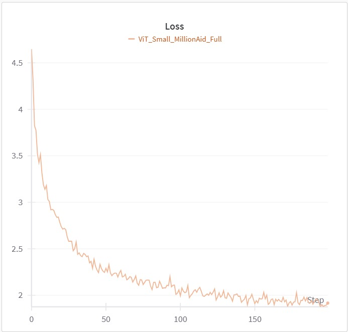
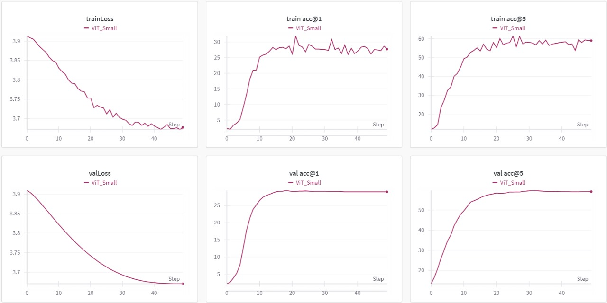

<div align="center">
  
  <h1>MoCoV3 Pretraining on MillionAID</h1>
  <p>A guide to pretraining MoCoV3 on the MillionAID dataset, including setup, dataset preparation and training results</p>
  <br/>


[](https://github.com/your_repo/mocov3_pretrain/releases)
[](https://arxiv.org/abs/2104.02057) <!-- Link to MoCoV3 paper -->
[](https://github.com/facebookresearch/moco-v3) <!-- Original MoCoV3 GitHub repo -->
[](https://github.com/AJAY-22/PreTraining_MoCo/issues) <!-- Replace with actual repo issues link -->

<!-- LinkedIn badges for team members -->
[](https://www.linkedin.com/in/ajay-pathak/) <!-- Replace with actual LinkedIn URL -->
[](https://www.linkedin.com/in/sourav-rout-4b3384176/) <!-- Replace with actual LinkedIn URL -->

 
</div>

---

## Table of Contents
- [Installation](#installation)
  - [Requirements](#requirements)
  - [Setup Environment](#setup-environment)
  - [Install Dependencies](#install-dependencies)
  - [Prepare Dataset](#prepare-dataset)
- [Usage](#usage)
- [Results](#results)

## Installation
### Requirements

This project requires the following:

- **Operating System**: Linux OS (recommended: Ubuntu 18.04 or later)
- **Python**: Version 3.8 or higher
- **PyTorch**: Version 1.9.0
- **CUDA**: Version 10.2
- **CuDNN**: Version 7.6.5
- **timm**: Version 0.4.9 (for ViT models)

To install PyTorch, CUDA, and other dependencies:

```bash
# Install PyTorch with CUDA support
pip install torch==1.9.0 torchvision==0.10.0 torchaudio==0.9.0 --extra-index-url https://download.pytorch.org/whl/cu102

# Install timm for Vision Transformer (ViT) models
pip install timm==0.4.9
```
### Setup Environment

To start, create and activate a new `conda` environment:

```shell
conda create -n mocov3_pretrain python=3.8 -y
conda activate mocov3_pretrain
```

## 📂 Data Preparation

To set up the MillionAID dataset for MoCoV3 pretraining, follow these steps to download, combine, and organize the dataset files.

---

### Step 1: Download MillionAID Dataset

A `download.sh` script is provided in the `dataset_prepare` folder. This script will automatically download all 17 parts of the MillionAID dataset and save them in the same directory.

1. **Run `download.sh`**: Execute the following commands to download the dataset:

    ```bash
    # Navigate to the dataset_prepare directory
    cd dataset_prepare

    # Run the download script
    bash download.sh
    ```

2. **Combine and Unzip**: Once the dataset is downloaded, combine and unzip the files with the following commands:

    ```bash
    # Combine all 17 parts of the MillionAID dataset into a single zip file
    cat millionaid_part*.zip > millionaid_combined.zip

    # Unzip the combined MillionAID zip file
    unzip millionaid_combined.zip -d millionaid_dataset

    # Clean up the part files and combined zip file after extraction
    rm millionaid_part*.zip millionaid_combined.zip

    echo "MillionAID dataset combined and extracted successfully."
    ```

This will download, combine, and extract the dataset into the `millionaid_dataset` folder.

---

### Step 2: Create a Subset of MillionAID (Optional)

To create a subset of the MillionAID dataset, run the `data_sample.py` script:

```bash
python dataset_prepare/data_sample.py
```
## Usage: Preparation

To set up MoCoV3 for self-supervised pretraining on the MillionAID dataset, follow the steps below. We used **6 NVIDIA A6000 GPUs** for pretraining with data-parallel processing, a batch size of **1024**, learning rate of **1.5e-4**, and **200 epochs** with a **warmup of 25 epochs**. For Vision Transformer (ViT) models, ensure `timm` is installed (`timm==0.4.9`).

The code has been tested with **CUDA 10.2**, **CuDNN 7.6.5**, **PyTorch 1.9.0**, and **timm 0.4.9**.

### Self-supervised Pre-Training

To start MoCoV3 pretraining on ViT-Small with the MillionAID dataset, run the following command:

```bash
python main_moco.py \
  -a vit_small -b 1024 \
  --optimizer adamw --lr 1.5e-4 --weight-decay .1 \
  --epochs 200 --warmup-epochs 25 \
  --stop-grad-conv1 --moco-m-cos --moco-t .2 \
  --dist-url 'tcp://localhost:10001' \
  --multiprocessing-distributed --world-size 1 --rank 0 \
  /path/to/millionaid_dataset
```
## Usage: Linear Classification

For linear classification, we fine-tuned the MLP layer and classification head on the MillionAID dataset while keeping the pretrained backbone frozen. We used **8,000 images** for training and **2,000 images** for testing from the MillionAID dataset with a **batch size of 1024**. This setup can be run on a single node with multiple GPUs.

To start the linear classification process, run the following command:

```bash
python -W ignore main_lincls.py
  -a [ARCH] --lr 5e-5   --dist-url 'tcp://localhost:10012'
  --multiprocessing-distributed --world-size 1 --rank 0
--pretrained [PATH/TO/PRETRAINED/MOCO/CHECKPOINT] [PATH/TO/LABELLED_DATASET]
```
## Results

The training curves for both pretraining on 150k images from the MillionAID dataset and the linear classification fine-tuning are provided below.

### Pretraining Results

Below is the loss curve from the MoCoV3 pretraining phase on the MillionAID 150k subset:



### Linear Classification Results

The following plots display the linear classification results on the frozen backbone with fine-tuned MLP and classification head. Training was performed on 8,000 images, with evaluation on a separate set of 2,000 images. The curves below show:

- **Training and Validation Loss**: Loss over epochs for both training and validation datasets.
- **Top-1 Accuracy**: The accuracy of the highest confidence prediction.
- **Top-5 Accuracy**: The accuracy when the correct class is within the top five predictions.



### Summary of Results

- **Pretraining Phase**: Captures the self-supervised learning on the MillionAID subset, focusing on representation learning through contrastive loss.
- **Classification Phase**: Assesses model performance on labeled data, validating the pretrained model’s ability to generalize to a downstream classification task.


